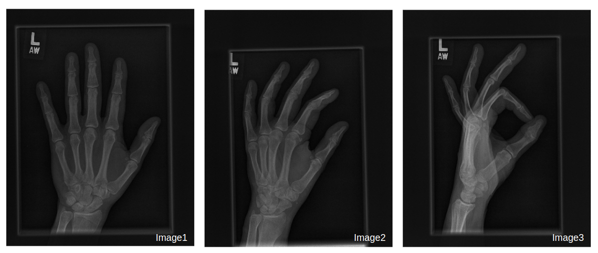

# Deep learning in RAD230

1. Download the MURA dataset prepared for the course: https://drive.google.com/drive/folders/1S6KJqwMqPXkE0JP74rpZou_rLaKnLeEo?usp=sharing
2. Upload the dataset to your Google Drive.
3. Run `01_MURA_hand_classification.ipynb` notebook.

